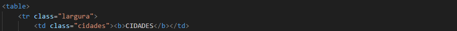
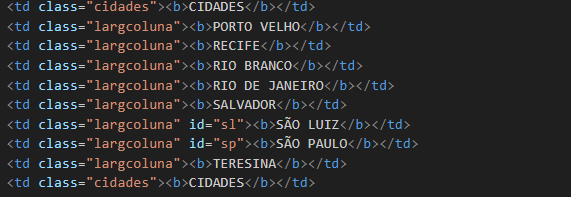
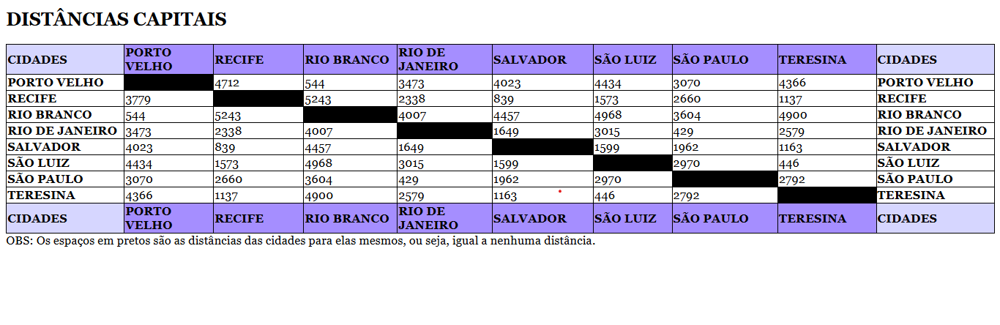

# Projeto - Tabela de Distâncias
Projeto criado como parte avaliativa da disciplina de Fundamentos de Desenvolvimento ministrada 
pelo professor Leonardo Rocha.

## Índice 

* [Descrição](#descrição)
* [Referências](#Referências)
* [Autor(a)](#autor)

### Descrição 

 O projeto consiste na composição de uma tabela que conta com capitais brasileiras e a distância 
    entre essas capitais. As capitais constantes nesse projeto são:

 * Porto Velho
 * Recife  
 * Rio Branco
 * Rio de Janeiro
 * Salvador 
 * São Luiz 
 * São Paulo
 * Teresina 

 ### Resultado do projeto 

#### Tabela 

* table- O elemento <table> HTML representa dados tabulares — isto é, informações apresentadas em uma tabela bidimensional composta por linhas e colunas de células contendo dados. 
* tr- A etiqueta <tr> que significa table row é usada para definir uma linha. A etiqueta <td> que significa table data é usada para definir uma célula. As tabelas podem ter cabeçalhos.

Veja uma imagem do código, onde é possivel identificar o uso dos elementos mencionados acima:
    

* td- As letras "td" significam "table data," que é o conteúdo de uma célula de dados. Uma célula de dados pode conter texto, imagens, listas, parágrafos, formulários, filetes horizontias, tabelas, etc.

Veja a imagem a seguir onde é possivel ver o uso do td:

#### Estilo

 

## Tecnologias 

* HTML5
* CSS3
* Git
* Github
## Referências 

[Alura](https://www.alura.com.br/artigos/escrever-bom-readme)- Como escrever um README incrível no seu Github

## Autor(a)

 O projeto foi desenvolvido pelo grupo:
 * Ana Laura
 * Brenda Gomes
 * Flora Natalia
 * João Pedro
 * Sabrina Cardoso
 * Willian Baracho 
